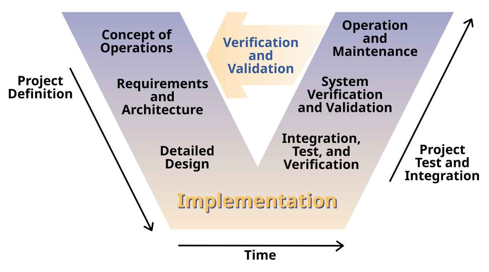

#+TITLE: 软件测试基础
* 总体观：软件测试围绕需求

测试围绕的中心是需求。测试不是单纯为了找bug，而是以用户需求为依据，判断产品是否符合需求；同时，测试也是 Verification 和 Validation 的统一：
 
- Verification: 产品有没有按照规格说明书正确实现
- Validation: 产品是不是用户真正需要的东西

软件测试 = 基于需求，对软件进行检查和评价，发现它和预期之间的差距。

测试的直接任务是发现缺陷，根本目的是评价软件是否满足需求、保证质量。
* 为什么要进行软件测试

1. 软件缺陷是客观存在的
2. 测试是质量保证中不可缺少的一环

因为软件开发过程中会出现沟通误解、需求不完善、设计不合理、接口不匹配、边界考虑不周、算法与性能问题等，所以必须通过软件测试来尽早发现和控制这些缺陷。

-----
* 什么是软件缺陷，什么是软件质量保证
软件缺陷：软件产品中存在的问题，最终表现为用户需要的功能没有完全实现，不能满足或不能全部满足用户的需求。它的表现包括：功能没实现、性能不达标、结果不一致、运行出错、系统崩溃、界面混乱、用户不能接受等。

*软件缺陷的本质*：软件没有满足需求。

*软件缺陷的表现*：功能没实现、性能不达标、结果不符、行为异常、界面混乱等。

质量保证：为了确保软件开发过程和结果符合预期要求，而建立的一系列规程、活动和评价。也就是说，质量保证不只是最后只测一遍，而是靠全过程的规范、控制、改进和验证。

- 质量控制：盯过程，减少偏差
- 质量保证：给出能够满足质量要求的证据
- 软件测试：质量保证的重要手段，但不是全部

软件测试与质量保证的关系：软件测试时质量保证体系中的核心活动之一。质量保证覆盖开发过程与结果，测试则通过静态与动态的方法验证产品是否满足要求，并为质量保证提供依据。

-----
* 静态测试与动态测试
这很容易和黑盒测试、白盒测试混为一谈。
** 静态测试
*不运行程序*。通过阅读、检查、分析来发现问题。需求评审、设计评审、代码评审放在静态测试里。
** 动态测试
*运行程序*，观察输出、行为、状态，发现缺陷。黑盒测试和白盒测试都属于动态测试的主要方法。

_静态测试看文档和代码，动态测试跑程序_ 。

-----
* 黑盒测试与白盒测试
** 黑盒测试
不看程序内部结构，只看输入和输出、功能和需求，依据需求规格说明书来设计测试。黑盒测试常用于功能验证、系统验证、验收测试。
** 白盒测试
看程序内部结构，根据语句、分支、条件、路径等来设计测试，关注程序内部逻辑。白盒测试通常用于单元测试和集成测试。
** 黑盒测试与白盒测试的关注点

- 黑盒：测功能有没有实现
- 白盒：测内部逻辑有没有问题、覆盖够不够

- 等价类、边界值、因果图、决策表 →黑盒
- 语句覆盖、判定覆盖、条件覆盖、基本路径 →白盒

-----
* 测试流程：从评审到验收
链路：\(需求评审 \rightarrow 设计评审 \rightarrow 单元测试 \rightarrow 集成测试 \rightarrow 功能验证测试 \rightarrow 系统测试 \rightarrow 验收测试 \)，并伴随着测试计划、测试用例设计、测试执行、结果分析和报告。
** 需求评审
检查需求定义是否正确、完整、可测试、符合客户期望。
** 设计评审
检查系统设计是否合理、是否具有可测试性、是否满足性能、安全、扩展性等要求。
** 单元测试
测试最小单元，强调独立性，主要采用白盒，也可辅以黑盒；通常要用驱动模块和桩模块帮助测试。
*** 桩模块和驱动模块
单元测试里，被测模块通常不能完全独立运行，所以通常需要调用“驱动模块”和“桩模块”来补齐测试环境。

驱动模块（driver）负责 *调用被测试模块*，用来模拟被测试模块的 *上级模块*。

驱动模块可以被理解为：发起调用的人，属于被测试模块的上游，主动把输入传入给被测模块，再返回接收结果、判断测试得对不对。

桩模块（stub），也叫存根程序，会模拟被 被测模块调用，用来模拟它依赖的下层模块。

桩模块是“假装成依赖的对象”。如果被测模块内部还需要去调用数据库、接口、别的函数，而那些函数还没有完成，或者不方便直接接入，就先用桩模块，返回一个预设好的结果。

- 驱动模块：模拟上游调用者
- 桩模块：模拟下层被调用者
** 集成测试
把单元测试组装起来，重点发现接口问题和模块间协同问题。
** 功能验证测试
从用户角度验证系统是否正常实现，通常使用黑盒。
** 系统测试
把软件放到完整环境里测试，包括安装、容错、安全、压力、性能等。
** 验收测试
发布前最后一次完整测试，核心特征是用户参与。
-----
* V 模型

V模型是把“软件开发阶段”和“测试阶段”一一对应起来的模型。

#+CAPTION: V 模型
#+NAME: fig:001

左侧是：
** 专案定义阶段
*** 需求分析
第一个阶段，也称为是验证（verification）阶段的第一个阶段。此阶段分析用户的需要，整理系统的需求（功能需求）。着重构建理想的系统，但不用决定软件的设计方式。
*** 系统设计
系统设计师根据用户需求文件，分析并理解开发系统的业务流程的阶段。系统设计阶段会列出要实现用户需求需要的技术以及可能性。
*** 架构设计
该阶段会设计计算机系统架构及软件架构，选择架构的基准是应该可以实现所有模组的列表、模组的简单机能、界面关系等。
*** 模组设计
模组设计阶段也称为低阶设计。将设计的系统拆解为较小的单元或模组，并说明每一部分的内容，让程式设计者可以直接写程序。
** 确认阶段
右侧是确认阶段。

V模型中，验证（或专案定义）阶段中的每一阶段，在确认阶段都会有对应的阶段。
*** 单元测试
模组设计 →单元测试。

单元测试的目的是要消除程序代码层级和单元层级的错误。单元是程序中可以独立存在的最小程序。
*** 集成测试
架构设计 →集成测试。

集成测试的计划在架构设计阶段确定。集成测试会确认独立创建、独立测试过的模组是否可以共存和互相交互信息。
*** 系统测试
系统设计 →系统测试。

系统测试计划会在系统设计的阶段确定。系统测试通常会由用户的团队来进行。系统测试会确保所开发的软件符合预期的需求，会测试整个程序的机能、相互依存以及通讯。系统测试也会验证系统符合的功能需求以及非功能需求。

负载测试、性能测试、压力测试、回归测试都是系统测试的一部分。
*** 验收测试
需求分析→验收测试。

用户验收测试计划在需求分析阶段就确定。测试计划是由企业用户来进行。用户验收测试会在用户的环境下进行，设法模拟实际产品的环境，也会使用实际的数据。用户验收测试的目的是要确认所提供的系统符合客户需求，而且系统已经可以在实际环境下使用。

-----
* 需求评审和设计评审

评审：对软件元素或项目状态进行评估，以判断是否与计划结果一致，并促进对其改进。评审可以是技术评审、文档评审、管理评审、流程评审。

需求评审的目标包括：
- 尽早发现需求问题，降低后期返工成本
- 保证需求可测试
- 让市场、产品、开发、测试对需求理解一致
- 为测试计划和测试范围打基础

需求评审看什么：
- 正确性
- 完备性
- 一致性
- 无二义性
- 可验证性
- 易追溯性

设计评审看什么：
- 稳定性、清晰性、合理性
- 耦合度与内聚度
- 数据与结构一致性
- 可测试性、可追溯性
- 安全性、性能、扩展性、可靠性

系统架构评审会关心单点故障、故障转移、负载均衡、关键业务设计是否合理；详细设计评审会看功能和接口定义、算法、数据流/控制流、模块独立性、可测试性。

-----
* 单元测试里必须记住的三个点
** 单元测试的对象
针对软件最小单元，强调独立性，缩小问题范围。
** 单元测试主要方法
主要是白盒测试，辅以黑盒测试。白盒用于代码评审和逻辑覆盖，黑盒可用于较大单元的功能验证。
** 驱动模块和桩模块
- 驱动模块：模拟上级模块，负责调用被测模块
- 桩模块：模拟下级模块，代替被测模块要调用的子模块

-----
* 速记

1. 测试围绕需求展开
2. 测试是Verificatio和Validation的统一
3. 静态测试不运行程序，动态测试运行程序
4. 黑盒测试看功能和输入输出，白盒测试看内部逻辑结构
5. 白盒测试常用于单元/集成，黑盒测试用于功能验证/系统/验收
6. 测试流程：\(需求评审 \rightarrow 设计评审 \rightarrow 单元测试 \rightarrow 集成测试 \rightarrow 功能验证 \rightarrow 系统测试 \rightarrow 验收测试\)
7. V 模型：单元测试和集成测试验证程序设计，系统测试验证系统设计，验收测试追溯用户需求
8. 单元测试常用驱动模块与桩模块辅助

