#+title: 看见系统
#+author: yurikon
#+language: zh-cn
* 第一周: 学会看见系统

前两周属于“阶段0：校准、修复文档与建立证据系统”。本周不追求新增功能，而是选择一个现有项目，建立系统边界、状态模型、所有权关系、外部效应和验证基线。

本周先集中处理Python Extract-Translator, C++ Pipeline 和 Qt 原型暂时只作为对照，不同时展开。

本周的主要问题是：

#+begin_quote
当我们看见一个已有程序时，究竟应该观察，才能开始进行设计判断。
#+end_quote

我们需要先辨认: *边界、状态、转移、所有权、效应和证据* 。

-----

* 为什么不能从“类”开始看系统

初学面向对象设计时，我们很容易把系统理解为一组类:

- Document
- Page
- TextBlock
- Translator
- PdfParser

然后开始讨论它们之间是继承、组合还是依赖。

问题在于：类只是语言提供的一种组织手段，它不等于系统本身。相同的系统行为，可以用类、函数、闭包、表、协程或进程实现。假如我们一开始就把注意力放在类上，就很容易把实现形式误以为问题结构。

为了避免这一点，可以先用一个更弱、但更普遍的模型观察程序:

#+begin_quote
(S_{t+1},O,E) = T(S_t, I)
#+end_quote

其中:

- S_t 是执行前状态
- I 是本次输入
- T 是发生的计算或状态转移
- S_{t+1} 是执行后的状态
- O 是返回给调用者的结果
- E 是对外部世界造成的效应

因此，可以用语言组织：普遍来说，模型发生一次调用，会根据输入改变状态、返回结果并对外部世界产生副作用。一个操作做的事情，往往不止是“根据输入返回输出”。

例如:

#+begin_src python
  def translate(text: str) -> str:
      ...
#+end_src

从类型签名看，它像是一个普通的字符串转换。但是实际上可能会:

- 访问 DeepL
- 消耗 API 配额
- 等待网络
- 超时
- 重试
- 写日志
- 缓存结果
- 抛出异常

这些都不在函数签名中体现的 ~str -> str~ 这个模型中。它们属于效应、失败和状态。

因此，本周要训练的第一种能力是： *不再仅根据函数名和类型签名理解函数* 。

-----

* 什么是状态

一种常见但过宽的定义是：“程序内存中的所有变量都是状态”。

从机器角度看，这当然成立，但对软件设计帮助不大。因此，更有用的定义是:

#+begin_quote
状态是那些会影响系统未来行为、未来输出或未来允许操作的信息。
#+end_quote

C++ Core Guideliness 术语表把状态简化为“一组值”，并把不变量描述为在程序某些位置必须成立的条件。更重要的是，它指出构造函数应当建立对象不变量，之后公开操作才能假设对象处于合法状态。

考虑 ~RawDocument~:

#+begin_src python
  @dataclass(frozen=True, slots=True)
  class RawDocument:
      document_id: DocumentId
      pages: tuple[PageLayout, ...]
#+end_src

它的 _状态_ 包括:

- ~document_id~
- ~pages~
- 每个 ~PageLayout~ 中的 ~elements~
- 每个元素的位置、文本和标识

但不是每个临时变量都应该进入设计模型。假设校验连续页码时写了 ~expected_page = 1~, 这只是算法执行中的 _临时状态_ , 却不是 ~RawDocument~ 应当具有的抽象状态。客户端并不会观察它，也不会在操作结束后继续影响对象行为。

因此要区分两层状态:

- 实现状态: 算法为了完成计算而暂时保存的信息
- 抽象状态: 对象或系统对外表现出的、持续影响行为的信息

这个区别以后会发展成两个重要概念：

- 抽象函数：具体表示如何对应抽象值
- 表示不变量: 哪些具体表示才能对应合法抽象值

-----

* 从状态中识别不变量

不变量是:

#+begin_quote
一旦不变量条件不成立，这个对象就不能再视为它声称代表的那个对象。
#+end_quote

例如：

#+begin_src python
  BoundingBox(x0=100, y0=50, x1=20, y1=80)
#+end_src
假设 ~BoundingBox~ 的语义是从左上角到右下角的矩形区域，那么通常需要:

#+begin_quote
x0 <= x1 \\
y0 <= y1
#+end_quote

否则就不能正常代表预期的矩形。

再看 ~RawDocument~:

- pages 非空
- 页码从1开始
- 页码连续
- 页码不重复

这些不变量并不处于同一个层级。比如 ~page_number >= 1~ 只需要检查一个 ~PageLayout~, 因此可以由 ~PageLayout~ 自己维护。而“所有页码连续”并不能由单个页面判断。第3页无法知道第2页是否存在。它依赖多个对象之间的关系，因此是 ~RawDocument~ 这一聚合层级的不变量。

这给出一条很重要的判断原则:

#+begin_quote
维护不变量的对象，必须拥有足够的信息来判断该不变量。
#+end_quote

比如下面的信息放在 ~PageLayout~ 中就不合理:

#+begin_src python
  def __post_init__(self) -> None:
      # 一个页面无法知道整个文档是否连续
      validate_document_page_sequence(...)
#+end_src

它缺少判断所需的信息，只能依靠外部的数据。这样会令一个局部对象承担全局责任。

相反，下面的分工比较合理:

- ~BoundingBox~: 维护坐标关系不变量
- ~PageLayout~: 维护页面尺寸、页码范围、页面内元素关系
- ~RawDocument~: 维护页面集合、页码顺序、跨页面关系

这里暂时留下一个问题: ~element_id~ 应当只在单页内唯一，还是必须在整个文档内唯一？

这里不是单靠代码能够回答的问题。它取决于 ~element_id~ 的抽象含义。

- 如果它表示“页面内部元素编号”，那么 ~(page_number, element_id)~ 才是完整身份，单页唯一即可。
- 如果它会被翻译、引用、持久化和跨页面查找，那么它可能需要文档范围内唯一。

因此，“不变量是什么”不能只从字段类型推导，还必须从系统用途推导。

-----

* 系统边界决定我们对什么负责

所谓系统边界，就是：

#+begin_quote
哪些行为由当前系统负责，哪些行为被视为外部环境。
#+end_quote

比如我们的 PDF-Extract-Translate, 可以先画出一个很粗的模型:

但这个边界还不够清晰。我们需要确定：哪些决定必须由我们系统掌握？

目前的需求是:

- 标题保留原文，不翻译
- 脚注保留
- 译文和原文交替输出
- 无法确定是否属于同一段时倾向合并
- 翻译按 ~TranslationUnit~ 批处理
- 单个段落保持稳定ID

这些不能简单交给 PDF 解析库或 DeepL 服务. 因为 PDF 解析库只能告诉我们：这里检测到一些文字、这里有一个坐标值、这里使用某个字体。却不能替我们做决定：

- 这个文本块是不是标题
- 两个文本块是不是同一段
- 这个内容是否需要翻译
- 翻译结果是如何重新装配的

PDF 解析库产生的是 **预测结果** ，不是领域事实。 DeepL 也只负责接收文本并返回翻译，不应该决定页面结构、段落身份或输出顺序。

因此，第一版本的系统边界可以写成:

#+begin_quote
系统外部:

- PDF 字节和文件路径
- PDF 解析库的对象模型
- DeepL API
- 文件读写
- 用户配置

系统内部:

- 将解析库数据转化为稳定的领域对象
- 识别页面元素的结构角色
- 合并或拆分段落
- 为段落分配稳定身份
- 组织 TranslationUnit
- 决定哪些内容翻译
- 将原文和译文重新装配
#+end_quote

-----

* 所有权

所有权不只是“谁负责释放内存”。C++中已经 ~unique_ptr~, ~shared_ptr~, 引用和RAII, 因此很容易把所有权理解为内存生命周期问题。

但这只是所有权的一部分，不是全部。在软件设计层面，所有权至少包含三个问题:

- 谁决定它存在
- 谁有权修改它
- 谁负责维持它的合法性

在 Python 中，即便有垃圾回收其负责实际内存释放，我们仍需要讨论逻辑所有权。比如:

#+begin_quote
RawDocuemnt
|-- pages
    |-- elements
#+end_quote
这里可以说:
- ~RawDocument~ 逻辑上 **拥有** 页面集合
- ~PageLayout~ 逻辑上 **拥有** 页面元素
- 外部代码可以读取这些内容，但不应任意修改
- 构造这些对象的代码负责确保它们合法

当前可以使用:

#+begin_src python
  @dataclass(frozen=True, slots=True)
#+end_src

可以限制字段重新赋值，但 Python 官方文档明确将 ~frozen=True~ 描述为对冻结实例的“模拟”：字段赋值会抛出异常，但它不等于语言层面的深度不可变。例如，冻结对象内部仍可能引用一个可变列表。 ~__post_init_()~ 则是在生成的初始化函数完成字段赋值后执行，适合进行跨字段校验。

因此:

#+begin_src python
  @dataclass(frozen=True)
  class Example:
      values: list[int]
#+end_src

并不是真正不可变:

#+begin_src python
  example.values.append(42)
#+end_src

仍然可能成功。所以元素类型可以考虑使用 ~tuple~, 这是因为它在表达:

#+begin_quote
这个对象构造之后，元素集合本身不应继续增删。
#+end_quote

这里，我们根据领域所有权，其拥有的对象是否能读写的权限，选择合适的字段类型。

这里已经出现了一个重要设计连接:

#+begin_example
领域语义
    ↓
所有权与修改权限
    ↓
字段类型
    ↓
语言能够检查的范围
#+end_example
